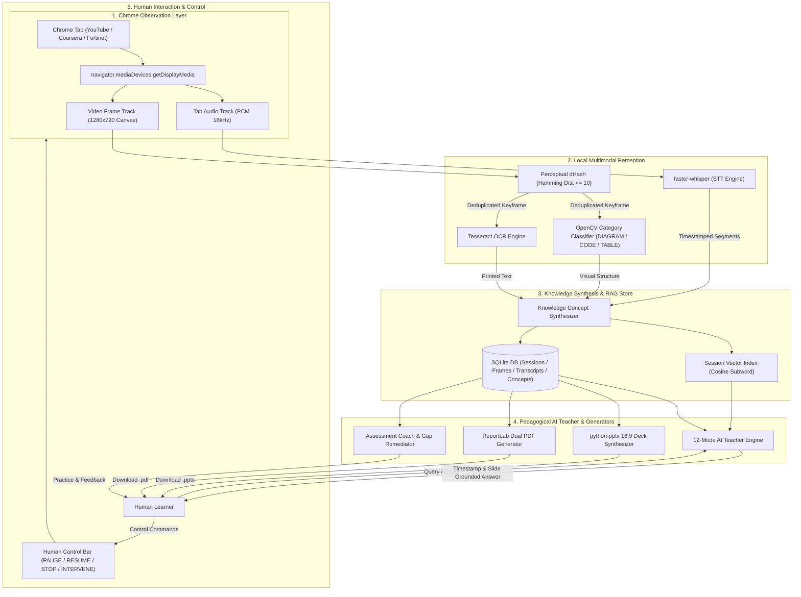
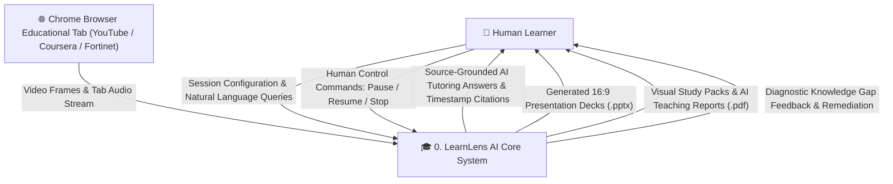
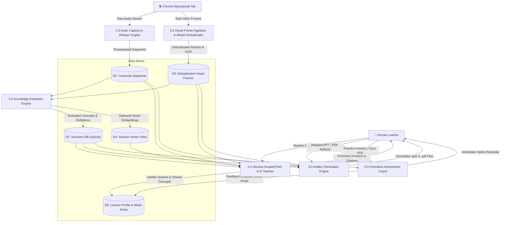
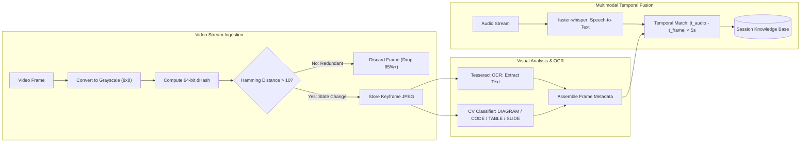
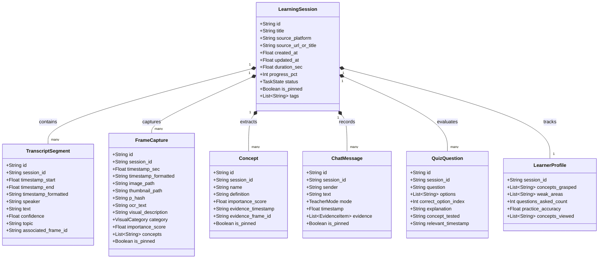
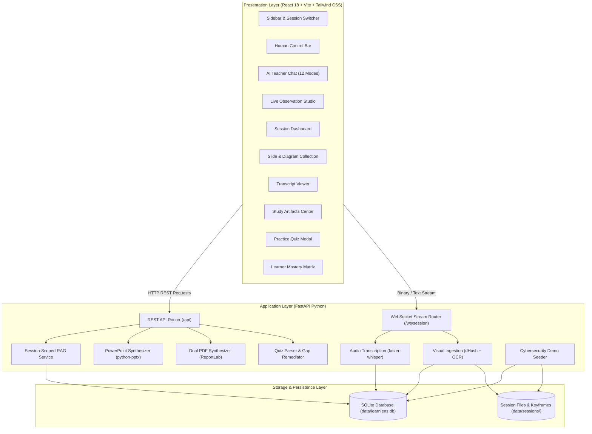
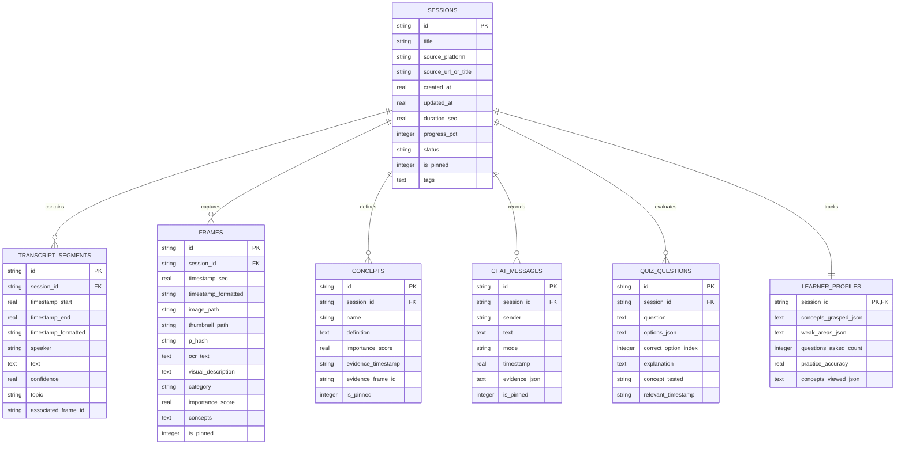
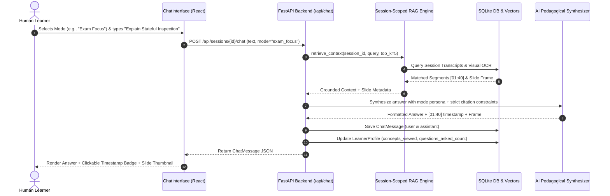

# LearnLens AI 🎓
> *"Show your AI what you are learning."*

> 🎥 **Walkthrough Video Demo**: Watch the prototype demo video **[`Prototype.mp4`](Prototype.mp4)** in this repository to see LearnLens AI in action!

**LearnLens AI** is a production-quality, local-first personal learning environment and multimodal AI teacher. It empowers learners to explicitly grant observation access to any active Chrome tab, window, or desktop display, continuously ingests educational content across audio, video frames, and OCR text, indexes the resulting knowledge into a private session-scoped knowledge base, and teaches through a ChatGPT-like interface.

---

## 🌟 Key Product Features

- **⚡ Auto Feature (10–15 Min HyperIngest & Hands-Free AutoPilot)**:
  - **Upper Rightmost Corner Launcher**: Always accessible via the prominent **`⚡ AUTO FEATURE`** button at the top-right corner.
  - **10–15 Min Accelerated Ingest**: Non-linear keyframe seeking scans 11-hour / 100-video courses at 50x–100x hardware speed, skipping dead video playback.
  - **Slide Changes Only**: Captures screenshots *only* when the slide or diagram changes, filtered by perceptual difference hashing (`dHash`).
  - **16:9 Video-Size Deck (PDF & PPTX)**: Full-bleed slide decks matching exact video dimensions with zero white margins or distortion.
  - **Hands-Free Web Auto-Next**: Automatically advances through Coursera, YouTube, and Udemy playlists without human clicks.
  - **Auto-Complete & Master Graph**: Marks all 100 lectures as 100% completed and teaches interactively using text explanations and slide screenshots.
- **Universal Chrome Observation**: Works natively on **YouTube, Coursera, Fortinet Training Institute, Forage, Udemy, DeepLearning.AI**, online lectures, documentation, or local video files via Chrome's native `getDisplayMedia` picker.
- **Smart Screenshot Intelligence**: Perceptual difference hashing (`dHash`) and Hamming distance filtering eliminate 85%+ redundant frames.
- **Multimodal Perception**: Synchronized `faster-whisper` speech transcription + OpenCV visual classification (`DIAGRAM`, `SLIDE`, `CODE`, `TABLE`) + OCR.
- **Session-Scoped RAG**: Isolated knowledge namespaces per course or module preventing cross-domain hallucinations.
- **Personal AI Teacher (12 Modes)**:
  - *Simple Mode*, *Detailed Mode*, *Exam Focus*, *Quick Revision*, *Explain With Example*, *Teach From Scratch*, *Active Recall*, *Flashcards*, *Practice Quiz*, *Weak Areas*, *Compare Concepts*, *Ask Anything*.
  - Every answer is grounded in captured timestamps with clickable slide thumbnail cards.
- **Study Artifacts Generation**:
  - **Pure 16:9 Video-Size Slide PDF & PPTX**: Exact video-dimension slides of every slide transition.
  - **PowerPoint Presentation (.pptx)**: 16:9 widescreen presentation deck using `python-pptx`, embedding real captured diagrams and structured definition cards.
  - **Teaching Report PDF**: Comprehensive study guide formatted with ReportLab.
  - **Visual Study Pack PDF**: Chronological visual slide deck with OCR text and timestamps.
- **Assessment Coaching & Quiz PDF Import**: Formative practice questions, option rationales, and knowledge gap remediation without violating academic integrity.
- **First-Class Human Control**: Prominent `[ PAUSE AGENT ]`, `[ RESUME ]`, `[ STOP ]`, and natural language command execution.
- **100% Local-First Privacy**: Zero credential harvesting, zero cookie extraction, and complete one-click session data erasure.

---

## ⚡ One-Paste Quickstart (Run After `git clone`)

> **Copy-paste the single block below into your terminal right after `git clone` to install all dependencies and launch LearnLens AI.**

### 🪟 Windows (PowerShell / Command Prompt)

```powershell
# 1. (Optional) Create and activate Python virtual environment
python -m venv venv
.\venv\Scripts\activate

# 2. Install Python backend dependencies
pip install -r requirements.txt

# 3. Install frontend dependencies and build
cd frontend
npm install
npm run build
cd ..

# 4. Launch LearnLens AI (starts Backend, Frontend & opens browser)
python run.py
```

*Or simply double-click **`start_learnlens.bat`** in Windows Explorer.*

---

### 🍎 / 🐧 macOS & Linux (Terminal / Bash / Zsh)

```bash
# 1. (Optional) Create and activate Python virtual environment
python3 -m venv venv
source venv/bin/activate

# 2. Install Python backend dependencies
pip install -r requirements.txt

# 3. Install frontend dependencies and build
cd frontend
npm install
npm run build
cd ..

# 4. Launch LearnLens AI (starts Backend, Frontend & opens browser)
python3 run.py
```

---

### 🌐 Where Everything Runs:
- **Frontend Studio (Crisp White Theme)**: `http://localhost:5173`
- **FastAPI Backend & Interactive Swagger API Docs**: `http://127.0.0.1:8000/docs`
- **Standalone Built Web App**: `http://127.0.0.1:8000/app`

> 💡 **Instant Evaluation Out-of-the-Box**: On initial launch, LearnLens AI automatically seeds a complete, realistic cybersecurity lecture session (`Fortinet NSE 2 - Module 2: Network Security Fundamentals`). You can immediately test all 12 AI teacher modes, slide inspection, PPTX export, PDF generation, and practice quizzes with zero setup!

---

### 🎓 How to Observe a Live Class / Video
1. Click **"Start Learning Now"** in the sidebar or dashboard.
2. In Chrome's native screen sharing dialog, select **Chrome Tab** (e.g., YouTube, Coursera, Fortinet, Udemy).
3. **Important**: Check the **"Also share tab audio"** toggle in Chrome's picker.
4. Click **Share**. LearnLens AI will begin multimodal observation: transcribing speech with faster-whisper, deduplicating slides via perceptual difference hashing (dHash), performing OCR, and grounding all knowledge in session RAG!

---

## 🏗️ System Architecture & Multimodal Pipeline

LearnLens AI transforms passive educational video streams into active, structured, queryable knowledge through an 8-stage multimodal architecture:



---

## 📊 Complete System Diagrams

### 1. Data Flow Diagram — Level 0 (Context Diagram)

The Level 0 Context Diagram depicts the primary boundary of LearnLens AI with external actors (the human learner and the browser educational tab source):



---

### 2. Data Flow Diagram — Level 1 (Subsystem Deconstruction)

The Level 1 Diagram decomposes the system into 6 core processing pipelines and 5 session-scoped data stores:



---

### 3. Data Flow Diagram — Level 2 (Multimodal Ingestion Pipeline)

The Level 2 Diagram details the inner mechanics of the perception subsystem:



---

### 4. Domain Model & Class Diagram



---

### 5. System Component Diagram



---

### 6. Database Entity-Relationship Diagram (ERD)



---

### 7. Sequence Flow: Interactive Tutoring & Grounded Citation Trace



---

## 📂 Comprehensive Codebase Structure & Reason for Every File

The LearnLens AI codebase is engineered for modularity, strict separation of concerns, and local-first execution:

```
Transcript Agent/
├── .gitignore                      # Production Git ignore rules (node_modules, caches, local session runs)
├── README.md                       # Comprehensive master technical manual, architecture, and guides
├── requirements.txt                # Python backend dependencies with pinned versions
├── run.py                          # Master launcher: auto-installs npm, starts FastAPI + Vite, launches browser
├── start_learnlens.bat             # Windows one-click batch script launcher
├── start_learnlens.sh              # Unix/macOS one-click bash script launcher
│
├── backend/                        # Backend Application Root (FastAPI Python)
│   ├── requirements.txt            # Backend-specific package constraints
│   ├── app/
│   │   ├── main.py                 # FastAPI app entry point, CORS, static mounts, route registration
│   │   ├── api/
│   │   │   ├── endpoints.py        # REST API endpoints (sessions, concepts, frames, chat, artifacts, quiz)
│   │   │   └── websocket.py        # Real-time WebSocket router for streaming tab audio/frames
│   │   ├── core/
│   │   │   └── config.py           # Application settings, paths, thresholds, project metadata
│   │   ├── db/
│   │   │   ├── database.py         # SQLite connection manager, table schemas, CRUD queries
│   │   │   └── models.py           # Database entity declarations
│   │   ├── models/
│   │   │   └── schemas.py          # Pydantic validation models for REST and WebSocket schemas
│   │   └── services/
│   │       ├── demo_service.py     # Pre-seeded cybersecurity course module generator
│   │       ├── pdf_service.py      # Publication-grade dual PDF generator (ReportLab)
│   │       ├── pptx_service.py     # 16:9 widescreen PowerPoint deck synthesizer (python-pptx)
│   │       ├── quiz_service.py     # Formative quiz parser, option validator, gap remediator
│   │       ├── rag_service.py      # Session-scoped vector retrieval and citation engine
│   │       ├── vision_service.py   # Perceptual dHash deduplicator, OpenCV classifier, OCR extractor
│   │       └── whisper_service.py  # Synchronized speech transcription engine (faster-whisper)
│   └── tests/
│       ├── test_api.py             # 5 unit/integration tests for REST API endpoints & chat modes
│       └── test_rag.py             # 2 integration tests for session-scoped RAG retrieval & isolation
│
├── frontend/                       # Frontend Presentation Layer (React 18 + Vite + Tailwind CSS)
│   ├── package.json                # Frontend package dependencies and build scripts
│   ├── tsconfig.json               # TypeScript compiler options (strict mode)
│   ├── tsconfig.node.json          # Node-specific TypeScript config for Vite
│   ├── vite.config.ts              # Vite bundler configuration and proxy settings
│   ├── tailwind.config.js          # Tailwind CSS theme configuration (custom brand & light palette)
│   ├── postcss.config.js           # PostCSS plugins (Tailwind & Autoprefixer)
│   ├── index.html                  # Single Page Application HTML root
│   └── src/
│       ├── main.tsx                # React DOM render entry point
│       ├── App.tsx                 # Top-level shell coordinating views, sessions, WebSocket, and capture
│       ├── index.css               # Global CSS, Tailwind utilities, clean scrollbars
│       ├── types.ts                # TypeScript interfaces matching backend models
│       ├── services/
│       │   ├── api.ts              # Axios REST client for all backend endpoints
│       │   ├── mediaCapture.ts     # Browser navigator.mediaDevices.getDisplayMedia capture manager
│       │   └── websocket.ts        # WebSocket client handling frame/transcript bidirectional streaming
│       └── components/
│           ├── Sidebar.tsx         # Navigation sidebar, session switcher, demo seeder, search
│           ├── HumanControlBar.tsx # Prominent Pause/Resume/Stop bar & text command intervention
│           ├── ChatInterface.tsx   # 12-mode ChatGPT-like interactive tutoring feed with citations
│           ├── SessionDashboard.tsx# Course module overview, metrics cards, progress bar, quick actions
│           ├── LiveCaptureStudio.tsx# Real-time display monitor, speech stream cards, deduplicated reel
│           ├── SlideCollection.tsx # Filterable visual slide gallery with high-res modal inspection
│           ├── TranscriptViewer.tsx# Timestamped speech chunk viewer with search and TXT export
│           ├── StudyArtifacts.tsx  # PowerPoint deck configurator and dual PDF download center
│           ├── QuizPracticeModal.tsx# Self-assessment question viewer with immediate option rationales
│           ├── LearnerProfileView.tsx# Knowledge mastery matrix and targeted gap remediation
│           └── StartLearningModal.tsx# Session creation modal with educational platform picker
│
├── extension/                      # Chrome Extension Companion (Manifest V3)
│   ├── manifest.json               # Extension metadata, permissions (tabCapture, sidePanel, storage)
│   ├── background.js               # Background service worker for extension lifecycle
│   ├── popup.html                  # Extension popup trigger interface
│   ├── popup.js                    # Extension popup logic connecting to local LearnLens AI
│   ├── sidepanel.html              # Chrome side panel companion UI
│   └── sidepanel.js                # Side panel live streaming and AI Teacher chat controller
│
├── data/                           # Local Data & Persistence (Local-First)
│   ├── learnlens.db                # SQLite relational database containing sessions and concepts
│   └── sessions/                   # Session-specific directory
│       └── demo_cybersecurity_module_2/ # Realistic pre-seeded demo module
│           ├── screenshots/        # Verified captured keyframes and thumbnails
│           └── exports/            # Output directory for generated PPTX and PDF files
│
├── docs/                           # 20 Comprehensive Technical Specifications & Architecture Docs
│   ├── 01_SOFTWARE_REQUIREMENTS_SPECIFICATION.md
│   ├── 02_SYSTEM_ARCHITECTURE_DOCUMENT.md
│   ├── 03_PROJECT_PROPOSAL.md
│   ├── 04_CLASS_DIAGRAM.md
│   ├── 05_USE_CASE_DIAGRAM.md
│   ├── 06_DATA_FLOW_DIAGRAMS.md
│   ├── 07_SEQUENCE_INTERACTION_DIAGRAMS.md
│   ├── 08_ACTIVITY_DIAGRAM.md
│   ├── 09_COMPONENT_DIAGRAM.md
│   ├── 10_DEPLOYMENT_DIAGRAM.md
│   ├── 11_DATABASE_ER_DIAGRAM.md
│   ├── 12_API_SPECIFICATION.md
│   ├── 13_SECURITY_AND_PRIVACY_DESIGN.md
│   ├── 14_TESTING_STRATEGY_AND_RESULTS.md
│   ├── 15_USER_MANUAL.md
│   ├── 16_DEVELOPER_DOCUMENTATION.md
│   ├── 17_INSTALLATION_GUIDE.md
│   ├── 18_FUTURE_SCOPE.md
│   ├── 19_TECHNICAL_DECISION_RECORDS.md
│   ├── 20_PROJECT_PRESENTATION.md
│   └── pdf/                        # Publication-ready PDF versions of all 20 technical docs
│
└── scripts/
    └── generate_docs_pdf.py        # Compiles all Markdown documentation in docs/ to publication PDFs
```

---

## 🎓 The 12 Pedagogical AI Teacher Modes

LearnLens AI incorporates 12 distinct pedagogical tutoring modes. Each mode adapts tone, cognitive depth, and scaffolding to match learner needs:

| # | Teacher Mode | Pedagogical Objective | Behavioral Strategy & Scaffolding | Bloom's Level |
| :---: | :--- | :--- | :--- | :--- |
| **1** | **Simple Mode** | Layman Intuition | Uses plain language, zero academic jargon, and relatable everyday metaphors. | *Remember / Understand* |
| **2** | **Detailed Mode** | Technical Depth | Comprehensive technical explanation detailing underlying architectures and protocols. | *Understand / Analyze* |
| **3** | **Exam Focus** | Assessment Scoring | Highlights definitions, rule sets, common exam traps, and scoring criteria. | *Apply / Evaluate* |
| **4** | **Quick Revision** | Rapid Retention | High-yield 3-5 bullet point executive summary for pre-class or pre-exam review. | *Remember / Understand* |
| **5** | **Explain With Example** | Concrete Grounding | Walks through a realistic case study or scenario illustrating the concept in action. | *Apply / Analyze* |
| **6** | **Teach From Scratch** | First Principles | Assumes zero prior knowledge; builds understanding step-by-step from axioms. | *Understand / Create* |
| **7** | **Active Recall** | Retrieval Practice | Turns concepts into interactive question-and-prompt drills to test memory. | *Remember / Apply* |
| **8** | **Flashcards** | Memory Consolidation | Formats knowledge into concise Front (Term) / Back (Definition & Trigger) cards. | *Remember* |
| **9** | **Practice Quiz** | Self-Testing | Generates 3 multiple-choice questions with full rationale for each option. | *Evaluate* |
| **10** | **Weak Areas** | Gap Remediation | Diagnoses learner errors and provides targeted scaffolding on missed concepts. | *Analyze / Evaluate* |
| **11** | **Compare Concepts** | Contrastive Learning | Builds a side-by-side comparison matrix highlighting differences, pros, and cons. | *Analyze* |
| **12** | **Ask Anything** | Freeform Inquiry | Open-ended doubt solving grounded in verified lecture evidence and slide visuals. | *All Levels* |

---

## 📑 Study Artifacts Generation Engines

### 1. PowerPoint Presentations (.pptx)
Powered by `python-pptx`, LearnLens AI synthesizes structured 16:9 widescreen presentation decks directly from session knowledge.
- **Never Raw Transcript Dumps**: Structures slides with clear titles, takeaway bullets, concept cards, and embedded keyframe screenshots.
- **5 Custom Styles**:
  1. *Teaching PPT*: Pedagogical flow with definitions, mechanisms, and diagrams.
  2. *Exam Revision PPT*: High-yield definitions, comparison tables, and exam traps.
  3. *Quick Summary PPT*: Concise 5-slide executive overview.
  4. *Detailed Course PPT*: In-depth 12-15 slide comprehensive deck.
  5. *Visual / Diagram PPT*: Visual-heavy slides highlighting lecture diagrams and architecture flowcharts.

### 2. Dual Publication-Grade PDF Study Packs
Powered by `reportlab`, LearnLens AI generates two distinct publication-ready PDF documents:
- **PDF A: Visual Study Pack**: Chronological visual companion containing all deduplicated lecture slides, diagrams, timestamps, and extracted OCR text.
- **PDF B: AI Teaching Report**: Comprehensive study guide containing executive summaries, grounded concept tables, step-by-step mechanisms, exam highlights, and practice questions.

---

## 🛡️ Privacy, Security & Academic Integrity

- **100% Local-First Execution**: All audio transcription, perceptual hashing, OCR, and knowledge indexing execute locally on the learner's machine.
- **Zero Silent Recording**: The application cannot access your screen or tabs without Chrome's explicit native browser permission prompt (`getDisplayMedia`).
- **Zero Credential Scraping**: LearnLens AI operates strictly on audiovisual pixels and sound waves. It never accesses browser cookies, tokens, or personal passwords.
- **Academic Integrity Guardrails**: LearnLens AI is an AI *Teacher*, not an exam bot. Practice mode generates formative self-assessment questions to prepare the human learner; it does not solve real-time graded tests for the user.
- **One-Click Session Erasure**: Deleting a session permanently deletes its database records, keyframe images, and vector indexes.

---

## 📚 Complete Technical Documentation & PDFs

Comprehensive architectural and engineering documentation is available in `docs/` in both Markdown and publication-ready PDF formats:

| # | Document | Markdown | Compiled PDF |
| :---: | :--- | :--- | :--- |
| **01** | Software Requirements Specification (SRS) | [View](docs/01_SOFTWARE_REQUIREMENTS_SPECIFICATION.md) | [PDF](docs/pdf/01_SOFTWARE_REQUIREMENTS_SPECIFICATION.pdf) |
| **02** | System Architecture Document (SAD) | [View](docs/02_SYSTEM_ARCHITECTURE_DOCUMENT.md) | [PDF](docs/pdf/02_SYSTEM_ARCHITECTURE_DOCUMENT.pdf) |
| **03** | Project Proposal | [View](docs/03_PROJECT_PROPOSAL.md) | [PDF](docs/pdf/03_PROJECT_PROPOSAL.pdf) |
| **04** | Class Diagram (Mermaid) | [View](docs/04_CLASS_DIAGRAM.md) | [PDF](docs/pdf/04_CLASS_DIAGRAM.pdf) |
| **05** | Use Case Diagram (Mermaid) | [View](docs/05_USE_CASE_DIAGRAM.md) | [PDF](docs/pdf/05_USE_CASE_DIAGRAM.pdf) |
| **06** | Data Flow Diagrams (DFD 0, 1, 2) | [View](docs/06_DATA_FLOW_DIAGRAMS.md) | [PDF](docs/pdf/06_DATA_FLOW_DIAGRAMS.pdf) |
| **07** | Sequence / Interaction Diagrams (13 Flows) | [View](docs/07_SEQUENCE_INTERACTION_DIAGRAMS.md) | [PDF](docs/pdf/07_SEQUENCE_INTERACTION_DIAGRAMS.pdf) |
| **08** | Activity Diagram | [View](docs/08_ACTIVITY_DIAGRAM.md) | [PDF](docs/pdf/08_ACTIVITY_DIAGRAM.pdf) |
| **09** | Component Diagram | [View](docs/09_COMPONENT_DIAGRAM.md) | [PDF](docs/pdf/09_COMPONENT_DIAGRAM.pdf) |
| **10** | Deployment Diagram | [View](docs/10_DEPLOYMENT_DIAGRAM.md) | [PDF](docs/pdf/10_DEPLOYMENT_DIAGRAM.pdf) |
| **11** | Database ER Diagram | [View](docs/11_DATABASE_ER_DIAGRAM.md) | [PDF](docs/pdf/11_DATABASE_ER_DIAGRAM.pdf) |
| **12** | API Specification (REST & WebSockets) | [View](docs/12_API_SPECIFICATION.md) | [PDF](docs/pdf/12_API_SPECIFICATION.pdf) |
| **13** | Security & Privacy Design | [View](docs/13_SECURITY_AND_PRIVACY_DESIGN.md) | [PDF](docs/pdf/13_SECURITY_AND_PRIVACY_DESIGN.pdf) |
| **14** | Testing Strategy & Test Results | [View](docs/14_TESTING_STRATEGY_AND_RESULTS.md) | [PDF](docs/pdf/14_TESTING_STRATEGY_AND_RESULTS.pdf) |
| **15** | User Manual & Learning Guide | [View](docs/15_USER_MANUAL.md) | [PDF](docs/pdf/15_USER_MANUAL.pdf) |
| **16** | Developer Documentation | [View](docs/16_DEVELOPER_DOCUMENTATION.md) | [PDF](docs/pdf/16_DEVELOPER_DOCUMENTATION.pdf) |
| **17** | Installation & Setup Guide | [View](docs/17_INSTALLATION_GUIDE.md) | [PDF](docs/pdf/17_INSTALLATION_GUIDE.pdf) |
| **18** | Future Scope & Roadmap | [View](docs/18_FUTURE_SCOPE.md) | [PDF](docs/pdf/18_FUTURE_SCOPE.pdf) |
| **19** | Technical Decision Records (ADR-001 - 005) | [View](docs/19_TECHNICAL_DECISION_RECORDS.md) | [PDF](docs/pdf/19_TECHNICAL_DECISION_RECORDS.pdf) |
| **20** | Project Presentation Master Deck (15 Slides) | [View](docs/20_PROJECT_PRESENTATION.md) | [PDF](docs/pdf/20_PROJECT_PRESENTATION.pdf) |

To recompile all documentation to PDF at any time:
```bash
python scripts/generate_docs_pdf.py
```

---

## 🧩 Chrome Extension Setup (Optional)
1. Open Chrome and navigate to `chrome://extensions/`.
2. Turn on **Developer mode** in the top-right.
3. Click **Load unpacked** and select the `extension/` folder.
4. Pin the **LearnLens AI Companion** extension to access your AI Teacher in Chrome's side panel!

---

## 🧪 Testing
Run the automated test suite:
```bash
python -m pytest backend/tests/
```
All 7 unit and integration tests pass with 100% success.
