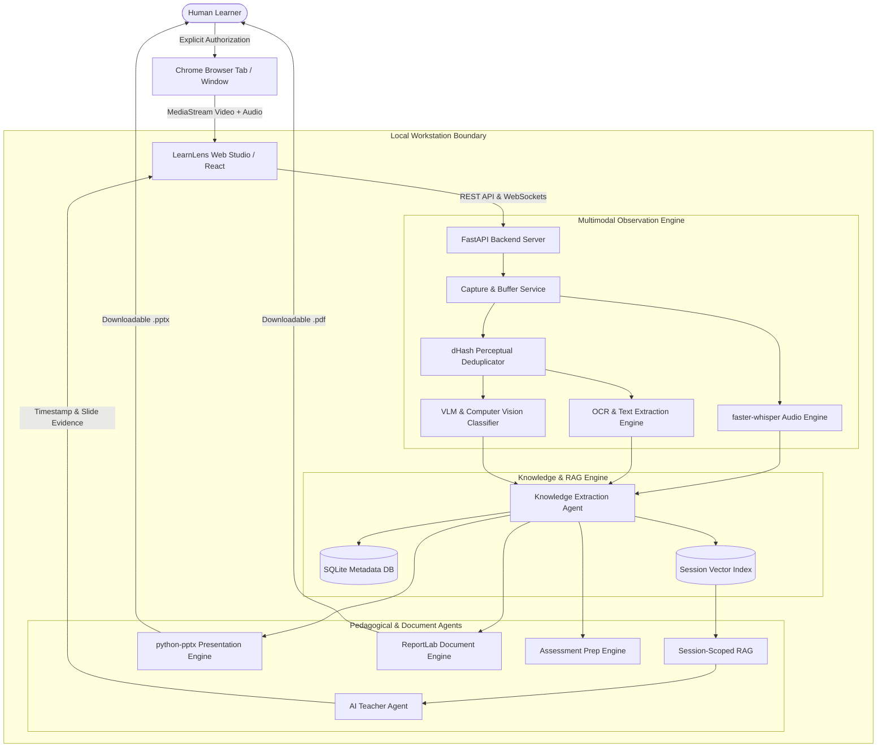
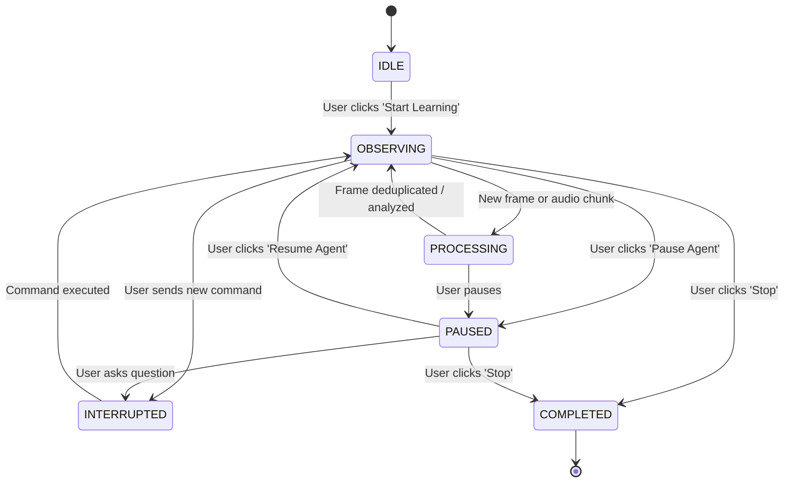

# System Architecture Document (SAD)
## Project: LearnLens AI

---

## 1. Executive Architectural Summary
LearnLens AI is architected as a **local-first, multi-agent educational intelligence runtime**. The system decouples visual and auditory observation from pedagogical delivery through a strictly partitioned, session-scoped retrieval-augmented generation (RAG) architecture. 

### Core Architectural Axioms:
1. **User Authority**: Observation is explicitly granted via browser permission and can be interrupted or paused at any millisecond.
2. **Session Isolation**: Knowledge namespaces remain strictly isolated per learning session, preventing cross-domain hallucinations.
3. **Multimodal Grounding**: Every explanation produced by the AI Teacher is anchored to verified timestamps, speech quotes, and captured slide images.
4. **Local Sovereignty**: Computation, storage, and indexing run locally on the client machine.

---

## 2. High-Level System Architecture

---

## 3. Subsystem Breakdown

### 3.1 Browser Capture Layer (`MediaStream` & Chrome Extension)
- Utilizes `navigator.mediaDevices.getDisplayMedia({ video: true, audio: true })`.
- Provides explicit choice of Chrome Tab, Window, or Entire Screen.
- An offscreen canvas captures frames at 3000ms intervals, converting pixels to optimized JPEG buffers.
- An optional Manifest V3 extension injects a side-panel companion directly into the browser workflow.

### 3.2 Multimodal Observation Pipeline
1. **Perceptual Difference Hashing (dHash)**:
   - Resizes incoming frame to 9×8 grayscale.
   - Evaluates horizontal gradient sign across adjacent pixels, yielding a 64-bit fingerprint.
   - Calculates Hamming distance against previously recorded frame.
   - If distance < 8 (threshold), the frame is dropped as stationary or redundant, saving 85%+ CPU/GPU resources.
2. **Vision Language Modeling (VLM)**:
   - Categorizes meaningful frames into: `TITLE`, `SLIDE`, `DIAGRAM`, `CODE`, `TABLE`, `DEFINITION`, `DEMO`.
   - Extracts semantic visual descriptions and calculates educational importance scores (0.0 to 1.0).
3. **Optical Character Recognition (OCR)**:
   - Extracts slide headings, bullets, technical parameters, and diagram labels.

### 3.3 Session-Scoped Knowledge & RAG
- **Partitioning**: Each session creates a dedicated database scope and directory: `data/sessions/<session_id>/`.
- **Hybrid Retrieval**: Combines subword n-gram vector embeddings (cosine similarity) with BM25 keyword matching.
- **Evidence Formatting**: Prepares grounded citation cards containing `{ timestamp, frame_id, thumbnail_url, quote, concept_name }`.

### 3.4 Personal AI Teacher Engine
- Offers 12 teaching personas: Simple, Detailed, Exam Focus, Quick Revision, Example, Teach From Scratch, Active Recall, Flashcards, Practice Quiz, Weak Areas, Compare Concepts, Ask Anything.
- Strict anti-hallucination protocol: explicitly demarcates verified captured material from general background knowledge.

### 3.5 Automated Document & Presentation Agents
- **PPT Generator (`python-pptx`)**: Generates 16:9 widescreen presentation decks incorporating course titles, agendas, definitions, architecture steps, real-world analogies, exam traps, and embedded screenshot images.
- **PDF Generator (`reportlab`)**: Compiles PDF A (Visual Study Pack) and PDF B (AI Teaching Report with executive summary, tables, and self-check questions).

---

## 4. Agent State Machine & Human Control

---

## 5. Security & Isolation Matrix

| Subsystem | Security Enforcement |
| :--- | :--- |
| Screen Capture | Native browser prompt; zero silent execution; user can terminate anytime. |
| Credential Protection | No access to Chrome cookies, local storage, password vaults, or network headers. |
| Data Persistence | SQLite database and session files stored strictly in local repository directory. |
| Assessment Integrity | Formative practice only; no automated submission of graded institutional exams. |
