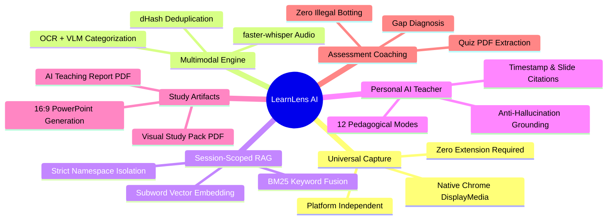

# Project Proposal
## LearnLens AI: Multimodal Personal Learning Runtime
### *"Show your AI what you are learning."*

---

## 1. Executive Summary
Modern education is severely fragmented. Students, technical professionals, and certification candidates spend hundreds of hours consuming video lectures and documentation across disjointed platforms (Coursera, YouTube, Fortinet, Forage, Udemy, etc.). The learning process is burdened by passive video watching, inefficient manual note-taking, inaccessible visual diagrams locked inside video frames, and difficulties in testing comprehension prior to exams.

**LearnLens AI** introduces a paradigm shift: instead of forcing the human learner to adapt to isolated AI tools or downloading third-party videos, LearnLens AI allows the user to grant explicit observation access to their active Chrome tab. The application observes, transcribes, visually interprets, and indexes the material into a private, session-scoped knowledge base, transforming passive video consumption into an active, ChatGPT-style tutoring experience.

---

## 2. The Problem
1. **Video Inefficiency**: A 60-minute technical lecture often contains only 12 minutes of core conceptual insights, buried under administrative remarks, code demonstrations, and repetitive explanations.
2. **Visual Blindness in Traditional AI**: Standard summarizers process only text transcripts or closed captions. They cannot perceive network architecture diagrams, terminal logs, code listings, mathematical equations, or slide comparisons.
3. **Platform Lock-In**: Dedicated platform extensions (e.g. YouTube summarizers) fail on corporate portals like Fortinet Training Institute, enterprise learning management systems, or local video files.
4. **Context Drift in General LLMs**: Generic chatbots like ChatGPT lack grounded knowledge of the specific slide version, rule set, or terminology taught in a particular university or certification course.
5. **Passive Knowledge Decay**: Learners review notes passively rather than engaging in source-grounded active recall and targeted revision of their personal weak areas.

---

## 3. The LearnLens AI Solution
LearnLens AI operates on a single elegant principle:
> **"Don't make the human adapt to the AI. Make the AI understand what the human is learning."**

The user opens any educational tab in Chrome, clicks **Start Learning**, and selects the tab via Chrome's native screen sharing dialog. LearnLens AI immediately begins:
- Streaming timestamped audio to a local transcription engine.
- Applying perceptual hashing to intelligently capture unique slides and diagrams while discarding duplicate frames.
- Running OCR and visual categorization on meaningful visuals.
- Extracting structured concepts, definitions, and relationships into a session-scoped knowledge base.
- Serving as a grounded, ChatGPT-style AI Teacher that cites exact timestamps and presents slide thumbnails for every answer.

---

## 4. Key Innovations

---

## 5. Educational Assessment Boundary
LearnLens AI maintains an uncompromised ethical boundary:
- **What LearnLens AI Does**: Ingests practice quizzes, explains question rationales, identifies tested concepts, recommends remedial lessons, and provides an interactive Practice Mode.
- **What LearnLens AI Never Does**: It never impersonates the student, never bypasses anti-cheat systems, never extracts login tokens, and never automatically submits graded certification exams.

**Product Philosophy**: *"AI prepares the human. The human controls the final action."*

---

## 6. Strategic & Commercial Impact
- **Educational Institutions**: Equips students with 24/7 personal tutors aligned specifically with course curricula.
- **Enterprise Upskilling**: Reduces the time needed for IT professionals to master complex certification tracks (e.g. Fortinet NSE, Cisco CCNA, AWS Solutions Architect) by 60%.
- **Accessibility**: Translates dense visual lectures into accessible structured notes and audio-driven tutoring.
