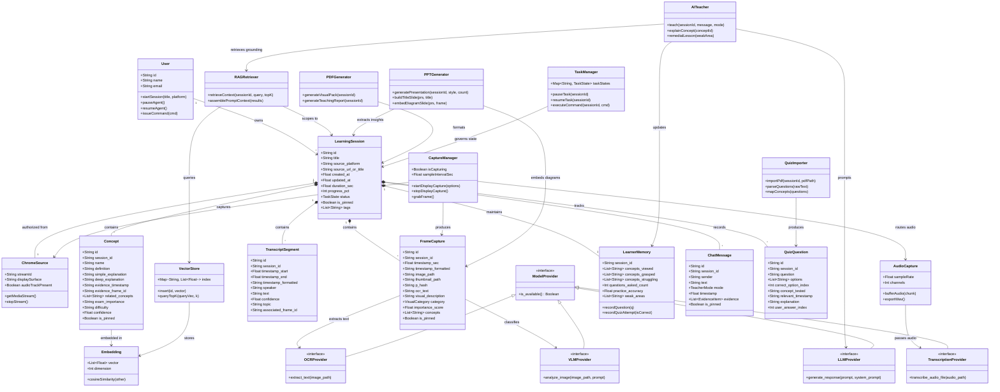

# Class Diagram
## Project: LearnLens AI

---

## 1. System Class Structure & Domain Model

```mermaid
classDiagram
    direction TB

    class User {
        +String id
        +String name
        +String email
        +startSession(title, platform)
        +pauseAgent()
        +resumeAgent()
        +issueCommand(cmd)
    }

    class LearningSession {
        +String id
        +String title
        +String source_platform
        +String source_url_or_title
        +Float created_at
        +Float updated_at
        +Float duration_sec
        +Int progress_pct
        +TaskState status
        +Boolean is_pinned
        +List~String~ tags
    }

    class ChromeSource {
        +String streamId
        +String displaySurface
        +Boolean audioTrackPresent
        +getMediaStream()
        +stopStream()
    }

    class CaptureManager {
        +Boolean isCapturing
        +Float sampleIntervalSec
        +startDisplayCapture(options)
        +stopDisplayCapture()
        +grabFrame()
    }

    class AudioCapture {
        +Float sampleRate
        +Int channels
        +bufferAudio(chunk)
        +exportWav()
    }

    class FrameCapture {
        +String id
        +String session_id
        +Float timestamp_sec
        +String timestamp_formatted
        +String image_path
        +String thumbnail_path
        +String p_hash
        +String ocr_text
        +String visual_description
        +VisualCategory category
        +Float importance_score
        +List~String~ concepts
        +Boolean is_pinned
    }

    class TranscriptSegment {
        +String id
        +String session_id
        +Float timestamp_start
        +Float timestamp_end
        +String timestamp_formatted
        +String speaker
        +String text
        +Float confidence
        +String topic
        +String associated_frame_id
    }

    class Concept {
        +String id
        +String session_id
        +String name
        +String definition
        +String simple_explanation
        +String deep_explanation
        +String evidence_timestamp
        +String evidence_frame_id
        +List~String~ related_concepts
        +String exam_importance
        +String difficulty
        +Float confidence
        +Boolean is_pinned
    }

    class Embedding {
        +List~Float~ vector
        +Int dimension
        +cosineSimilarity(other)
    }

    class VectorStore {
        +Map~String, List~Float~~ index
        +insert(id, vector)
        +queryTopK(queryVec, k)
    }

    class RAGRetriever {
        +retrieveContext(sessionId, query, topK)
        +assemblePromptContext(results)
    }

    class LearnerMemory {
        +String session_id
        +List~String~ concepts_viewed
        +List~String~ concepts_grasped
        +List~String~ concepts_struggling
        +Int questions_asked_count
        +Float practice_accuracy
        +List~String~ weak_areas
        +recordQuestion(q)
        +recordQuizAttempt(isCorrect)
    }

    class ChatMessage {
        +String id
        +String session_id
        +String sender
        +String text
        +TeacherMode mode
        +Float timestamp
        +List~EvidenceItem~ evidence
        +Boolean is_pinned
    }

    class AITeacher {
        +teach(sessionId, message, mode)
        +explainConcept(conceptId)
        +remedialLesson(weakArea)
    }

    class TaskManager {
        +Map~String, TaskState~ taskStates
        +pauseTask(sessionId)
        +resumeTask(sessionId)
        +executeCommand(sessionId, cmd)
    }

    class PPTGenerator {
        +generatePresentation(sessionId, style, count)
        +buildTitleSlide(prs, title)
        +embedDiagramSlide(prs, frame)
    }

    class PDFGenerator {
        +generateVisualPack(sessionId)
        +generateTeachingReport(sessionId)
    }

    class QuizImporter {
        +importPdf(sessionId, pdfPath)
        +parseQuestions(rawText)
        +mapConcepts(questions)
    }

    class QuizQuestion {
        +String id
        +String session_id
        +String question
        +List~String~ options
        +Int correct_option_index
        +String concept_tested
        +String relevant_timestamp
        +String explanation
        +Int user_answer_index
    }

    %% Provider Abstractions
    class ModelProvider {
        <<interface>>
        +is_available() Boolean
    }

    class LLMProvider {
        <<interface>>
        +generate_response(prompt, system_prompt)
    }

    class VLMProvider {
        <<interface>>
        +analyze_image(image_path, prompt)
    }

    class TranscriptionProvider {
        <<interface>>
        +transcribe_audio_file(audio_path)
    }

    class OCRProvider {
        <<interface>>
        +extract_text(image_path)
    }

    %% Relationships
    User "1" --> "*" LearningSession : owns
    LearningSession "1" *-- "1" ChromeSource : authorized from
    LearningSession "1" *-- "*" FrameCapture : contains
    LearningSession "1" *-- "*" TranscriptSegment : contains
    LearningSession "1" *-- "*" Concept : contains
    LearningSession "1" *-- "*" ChatMessage : records
    LearningSession "1" *-- "1" LearnerMemory : maintains
    LearningSession "1" *-- "*" QuizQuestion : tracks

    CaptureManager --> ChromeSource : captures
    CaptureManager --> FrameCapture : produces
    CaptureManager --> AudioCapture : routes audio

    AudioCapture --> TranscriptionProvider : passes audio
    FrameCapture --> OCRProvider : extracts text
    FrameCapture --> VLMProvider : classifies

    Concept --> Embedding : embedded in
    VectorStore --> Embedding : stores
    RAGRetriever --> VectorStore : queries
    RAGRetriever --> LearningSession : scopes to

    AITeacher --> RAGRetriever : retrieves grounding
    AITeacher --> LLMProvider : prompts
    AITeacher --> LearnerMemory : updates

    PPTGenerator --> LearningSession : extracts insights
    PPTGenerator --> FrameCapture : embeds diagrams
    PDFGenerator --> LearningSession : formats
    QuizImporter --> QuizQuestion : produces
    TaskManager --> LearningSession : governs state

    ModelProvider <|-- LLMProvider
    ModelProvider <|-- VLMProvider
    ModelProvider <|-- TranscriptionProvider
    ModelProvider <|-- OCRProvider
```
