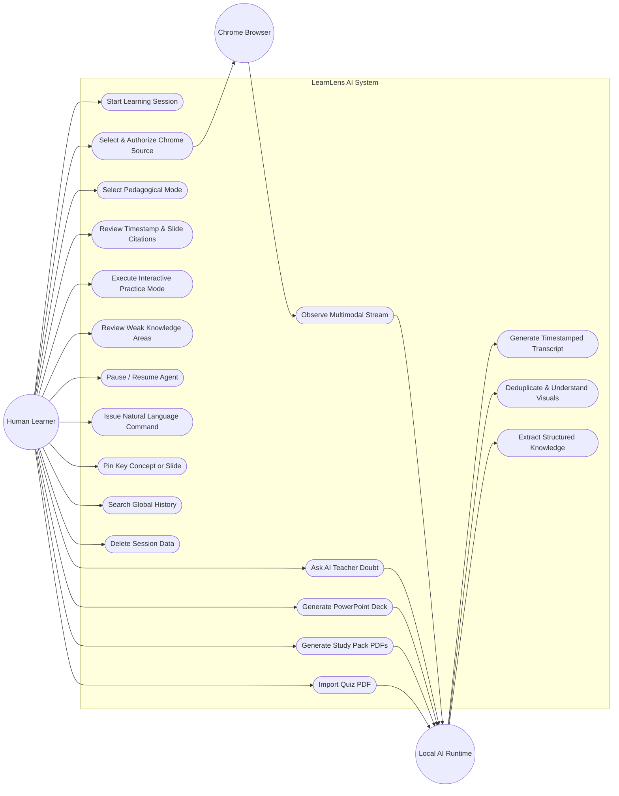

# Use Case Diagram
## Project: LearnLens AI

---

## 1. Actors
1. **Human Learner**: The primary user who grants permissions, studies, asks doubts, practices quizzes, and controls the agent.
2. **Chrome Browser**: The authorized host application providing the media display stream and tab context.
3. **Local AI Runtime**: Local background engine orchestrating Whisper, OpenCV, OCR, and Ollama/heuristics.
4. **Optional Model Provider**: External or local swap-in LLM/VLM services.

---

## 2. Use Case Model

---

## 3. Core Use Case Specifications

### Use Case UC-01: Start Learning & Select Source
- **Primary Actor**: Human Learner.
- **Preconditions**: Chrome browser is open with educational lecture tab.
- **Main Flow**:
  1. Learner clicks "Start Learning" in LearnLens AI.
  2. System displays platform selection and native authorization prompt.
  3. Chrome renders the native display picker (Tab / Window / Screen).
  4. Learner chooses target educational tab and checks "Share tab audio".
  5. System begins real-time observation pipeline.

### Use Case UC-07: Ask AI Teacher Doubt
- **Primary Actor**: Human Learner.
- **Preconditions**: Session has captured at least 1 minute of instructional content.
- **Main Flow**:
  1. Learner enters question into AI Teacher input field.
  2. System queries session-scoped RAG for matching concepts, speech quotes, and slide images.
  3. AI Teacher synthesizes explanation based on selected pedagogical mode.
  4. Output is rendered with exact timestamp tags and slide thumbnail cards.
  5. Learner can click any citation to inspect the original visual frame.

### Use Case UC-15: Pause and Resume Agent
- **Primary Actor**: Human Learner.
- **Preconditions**: Agent is in `OBSERVING` state.
- **Main Flow**:
  1. Learner clicks `[ PAUSE AGENT ]`.
  2. State machine transitions immediately to `PAUSED`.
  3. Frame ingestion stops while existing knowledge remains fully queryable.
  4. Learner clicks `[ RESUME AGENT ]`.
  5. State machine transitions to `OBSERVING` and frame capture resumes seamlessly.
