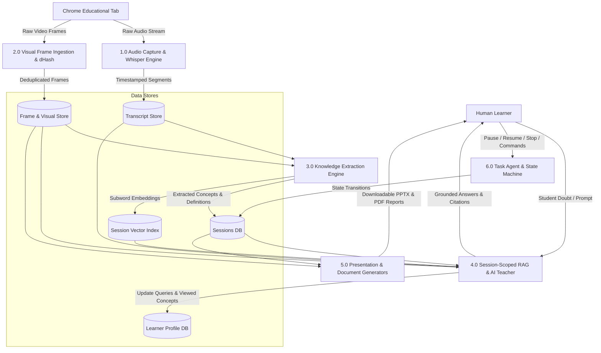
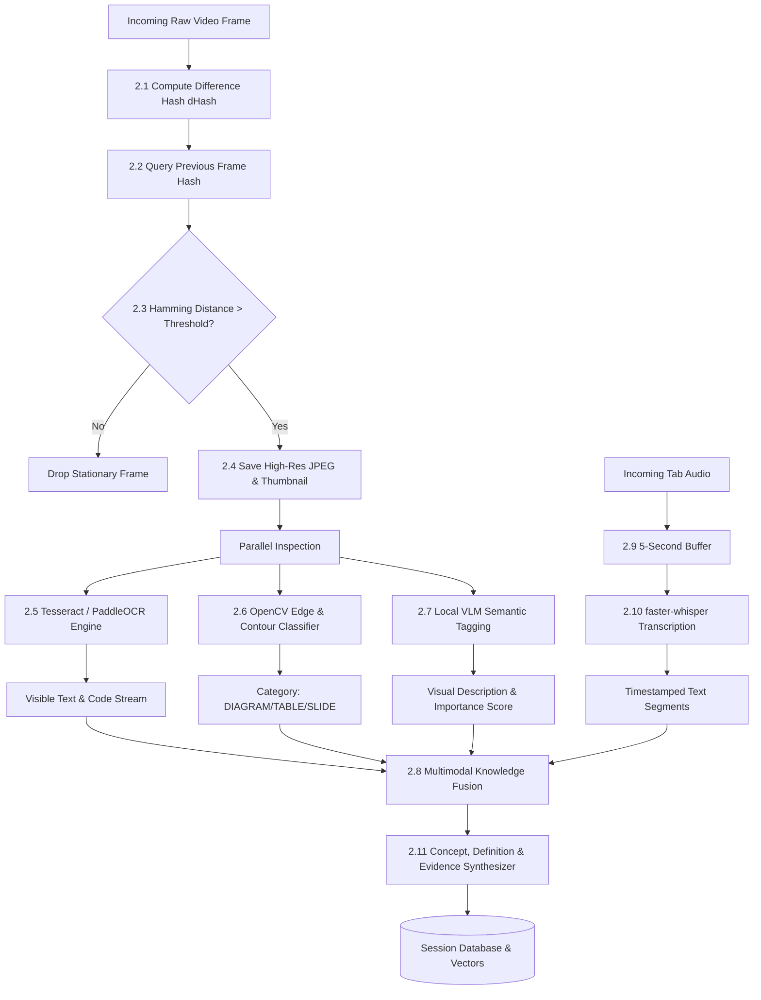

# Data Flow Diagrams (DFD)
## Project: LearnLens AI

---

## 1. DFD Level 0 (Context Diagram)

```mermaid
flowchart TD
    Human[Human Learner]
    Chrome[Chrome Browser Educational Tab]
    LLAI[0. LearnLens AI Core System]

    Chrome -->|Video Frames & Tab Audio Stream| LLAI
    Human -->|Session Configuration & Natural Language Queries| LLAI
    Human -->|Human Control Commands: Pause/Resume/Stop| LLAI

    LLAI -->|Source-Grounded AI Tutoring Answers & Citations| Human
    LLAI -->|Generated 16:9 Presentation Decks (.pptx)| Human
    LLAI -->|Visual Study Packs & AI Teaching Reports (.pdf)| Human
    LLAI -->|Diagnostic Knowledge Gap Feedback| Human
```

---

## 2. DFD Level 1 (Subsystem Deconstruction)



---

## 3. DFD Level 2 (Multimodal Processing Detail)


