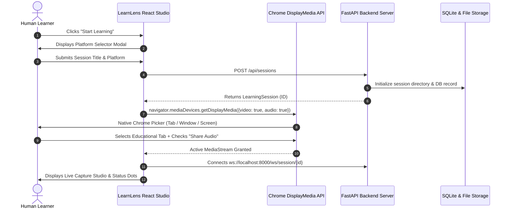
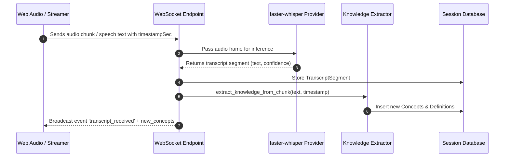
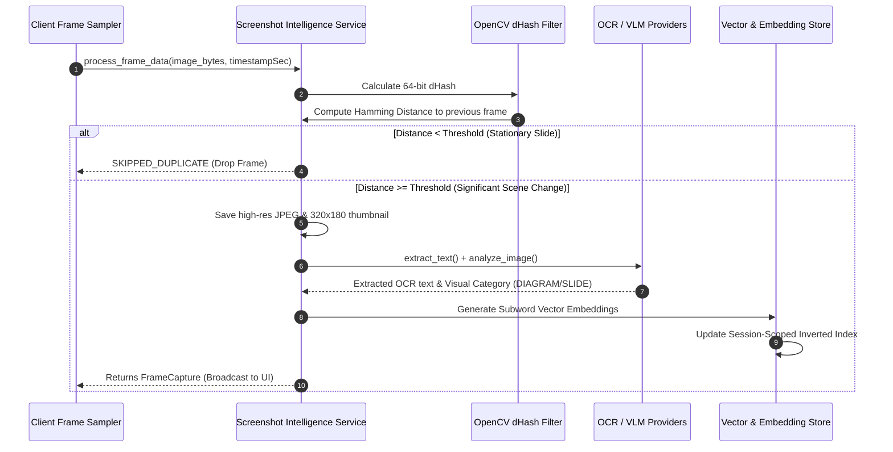
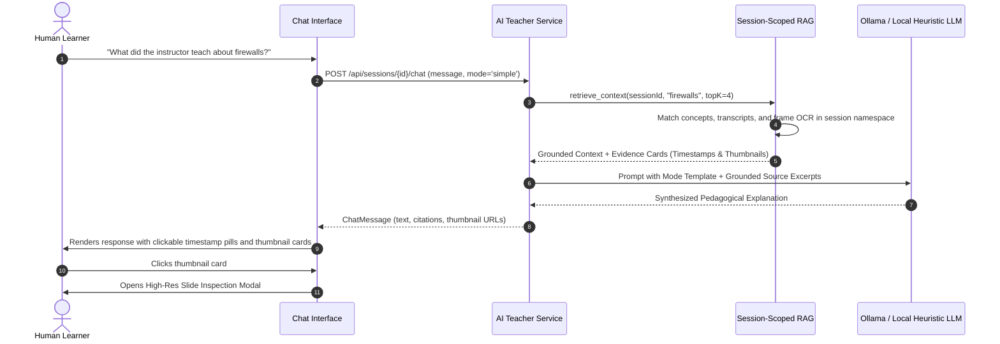
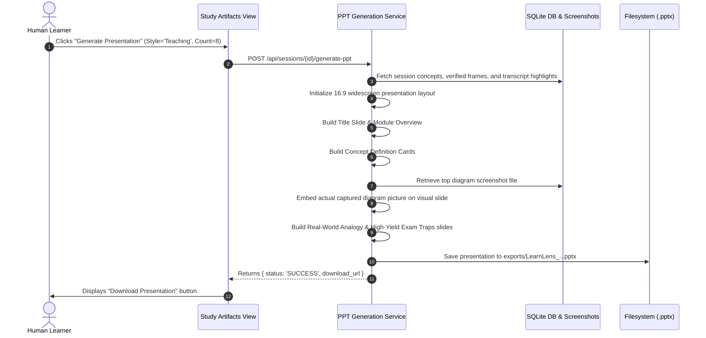
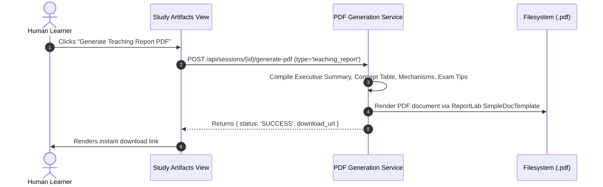
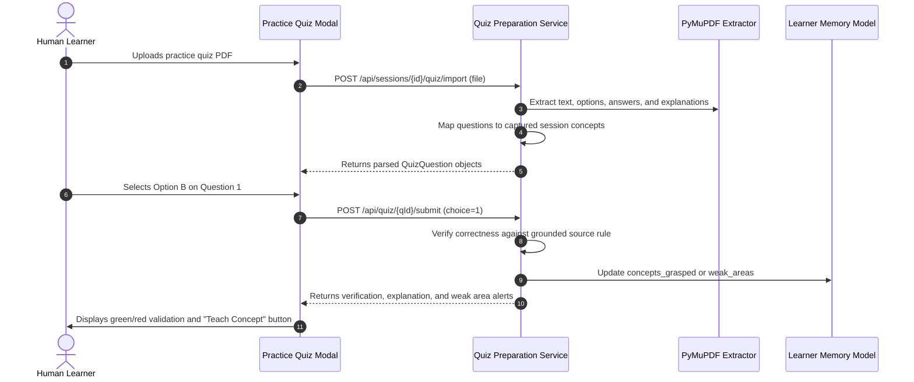
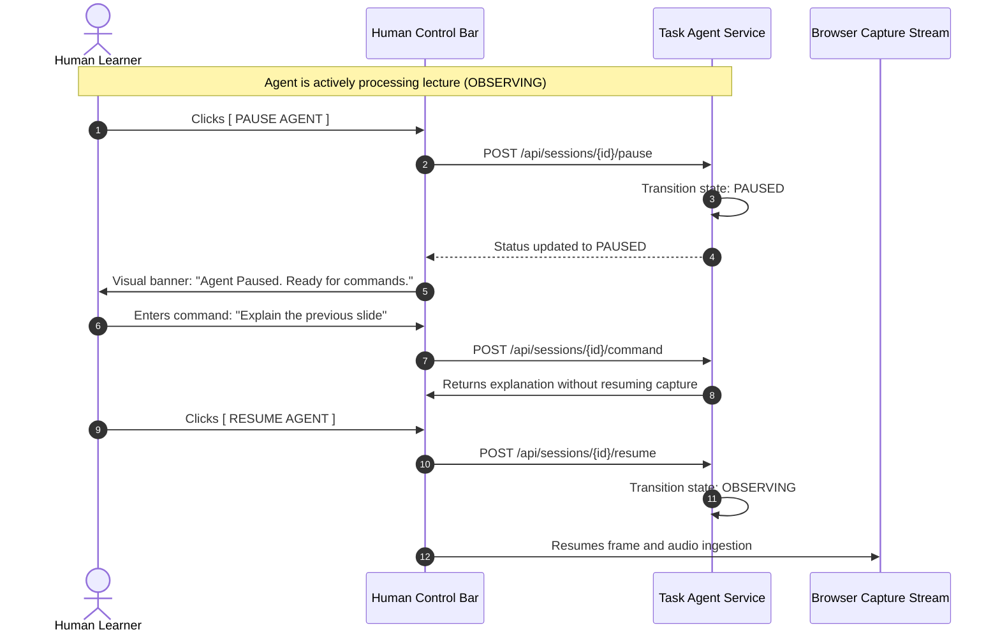
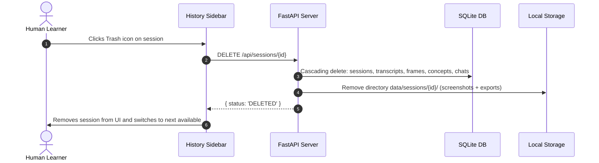

# Sequence & Interaction Diagrams
## Project: LearnLens AI

---

## 1. Flow 1 & 2: Start Learning & Chrome Tab Permission

---

## 2. Flow 3: Audio Transcription & Timestamp Sync

---

## 3. Flow 4 & 5: Important Screenshot Detection & RAG Update

---

## 4. Flow 6 & 7: User Asks Doubt & AI Answers With Evidence

---

## 5. Flow 8: PowerPoint Generation (`python-pptx`)

---

## 6. Flow 9: PDF Study Pack Generation (`reportlab`)

---

## 7. Flow 10: Import Quiz PDF & Gap Diagnosis

---

## 8. Flow 11 & 12: Human Interrupts & Resumes Agent

---

## 9. Flow 13: Delete Session & Purge Local Files

