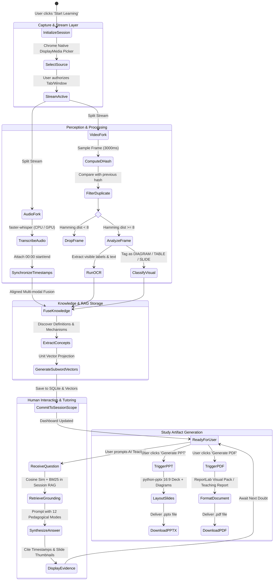

# Activity Diagram
## Project: LearnLens AI

---

## 1. End-to-End Multimodal Observation & Tutoring Lifecycle

```mermaid
stateDiagram-v2
    [*] --> InitializeSession: User clicks 'Start Learning'
    
    state "Capture & Stream Layer" as Capture {
        InitializeSession --> SelectSource: Chrome Native DisplayMedia Picker
        SelectSource --> StreamActive: User authorizes Tab/Window
        StreamActive --> AudioFork: Split Stream
        StreamActive --> VideoFork: Split Stream
    }

    state "Perception & Processing" as Processing {
        AudioFork --> TranscribeAudio: faster-whisper (CPU / GPU)
        TranscribeAudio --> SynchronizeTimestamps: Attach 00:00 start/end
        
        VideoFork --> ComputeDHash: Sample Frame (3000ms)
        ComputeDHash --> FilterDuplicate: Compare with previous hash
        
        state duplicate_decision <<choice>>
        FilterDuplicate --> duplicate_decision
        duplicate_decision --> DropFrame: Hamming dist < 8
        duplicate_decision --> AnalyzeFrame: Hamming dist >= 8
        
        AnalyzeFrame --> RunOCR: Extract visible labels & text
        AnalyzeFrame --> ClassifyVisual: Tag as DIAGRAM / TABLE / SLIDE
        
        SynchronizeTimestamps --> FuseKnowledge: Aligned Multi-modal Fusion
        RunOCR --> FuseKnowledge
        ClassifyVisual --> FuseKnowledge
    }

    state "Knowledge & RAG Storage" as Knowledge {
        FuseKnowledge --> ExtractConcepts: Discover Definitions & Mechanisms
        ExtractConcepts --> GenerateSubwordVectors: Unit Vector Projection
        GenerateSubwordVectors --> CommitToSessionScope: Save to SQLite & Vectors
    }

    state "Human Interaction & Tutoring" as Tutoring {
        CommitToSessionScope --> ReadyForUser: Dashboard Updated
        ReadyForUser --> ReceiveQuestion: User prompts AI Teacher
        ReceiveQuestion --> RetrieveGrounding: Cosine Sim + BM25 in Session RAG
        RetrieveGrounding --> SynthesizeAnswer: Prompt with 12 Pedagogical Modes
        SynthesizeAnswer --> DisplayEvidence: Cite Timestamps & Slide Thumbnails
        DisplayEvidence --> ReadyForUser: Await Next Doubt
    }

    state "Study Artifact Generation" as Exports {
        ReadyForUser --> TriggerPPT: User clicks 'Generate PPT'
        TriggerPPT --> LayoutSlides: python-pptx 16:9 Deck + Diagrams
        LayoutSlides --> DownloadPPTX: Deliver .pptx file
        
        ReadyForUser --> TriggerPDF: User clicks 'Generate PDF'
        TriggerPDF --> FormatDocument: ReportLab Visual Pack / Teaching Report
        FormatDocument --> DownloadPDF: Deliver .pdf file
    }
```
