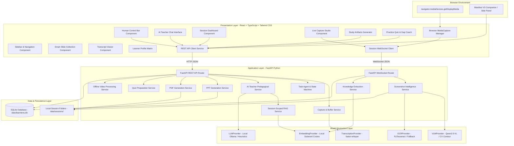

# Component Diagram
## Project: LearnLens AI

---

## 1. Component Architecture & Interfaces

```mermaid
graph TD
    subgraph Frontend [Presentation Layer - React + TypeScript + Tailwind CSS]
        UI_Sidebar[Sidebar & Navigation Component]
        UI_Control[Human Control Bar Component]
        UI_Chat[AI Teacher Chat Interface]
        UI_Dash[Session Dashboard Component]
        UI_Live[Live Capture Studio Component]
        UI_Slides[Smart Slide Collection Component]
        UI_Trans[Transcript Viewer Component]
        UI_Artifacts[Study Artifacts Generator]
        UI_Quiz[Practice Quiz & Gap Coach]
        UI_Learner[Learner Profile Matrix]
        
        CaptureClient[Browser MediaCapture Manager]
        WSClient[Session WebSocket Client]
        APIClient[REST API Client Service]
    end

    subgraph ChromeEnv [Browser Environment]
        DisplayMedia[navigator.mediaDevices.getDisplayMedia]
        Extension[Manifest V3 Companion / Side Panel]
    end

    subgraph BackendApp [Application Layer - FastAPI Python]
        APIRouter[FastAPI REST API Router]
        WSRouter[FastAPI WebSocket Router]
        
        CaptureSvc[Capture & Buffer Service]
        DHashSvc[Screenshot Intelligence Service]
        KnowledgeSvc[Knowledge Extraction Service]
        RAGSvc[Session-Scoped RAG Service]
        TeacherSvc[AI Teacher Pedagogical Service]
        TaskSvc[Task Agent & State Machine]
        PPTSvc[PPT Generation Service]
        PDFSvc[PDF Generation Service]
        QuizSvc[Quiz Preparation Service]
        VideoSvc[Offline Video Processing Service]
    end

    subgraph Providers [Model Abstraction Layer]
        LLM[LLMProvider - Local Ollama / Heuristics]
        VLM[VLMProvider - Qwen2.5-VL / CV Contour]
        STT[TranscriptionProvider - faster-whisper]
        OCR[OCRProvider - PyTesseract / Fallback]
        EMB[EmbeddingProvider - Local Subword Cosine]
    end

    subgraph Persistence [Data & Persistence Layer]
        DB[(SQLite Database - data/learnlens.db)]
        DiskStore[Local Session Folders - data/sessions/]
    end

    %% Connections
    DisplayMedia --> CaptureClient
    CaptureClient --> WSClient
    Extension --> APIClient
    
    UI_Control --> APIClient
    UI_Chat --> APIClient
    UI_Dash --> APIClient
    UI_Live --> WSClient
    UI_Artifacts --> APIClient
    UI_Quiz --> APIClient

    APIClient -->|HTTP JSON| APIRouter
    WSClient -->|WebSocket JSON| WSRouter

    APIRouter --> CaptureSvc
    APIRouter --> TaskSvc
    APIRouter --> TeacherSvc
    APIRouter --> PPTSvc
    APIRouter --> PDFSvc
    APIRouter --> QuizSvc
    APIRouter --> VideoSvc

    WSRouter --> DHashSvc
    WSRouter --> KnowledgeSvc

    DHashSvc --> VLM
    DHashSvc --> OCR
    CaptureSvc --> STT
    KnowledgeSvc --> EMB
    RAGSvc --> EMB
    TeacherSvc --> RAGSvc
    TeacherSvc --> LLM
    PPTSvc --> DiskStore
    PDFSvc --> DiskStore

    APIRouter --> DB
    WSRouter --> DB
    DHashSvc --> DiskStore
```
