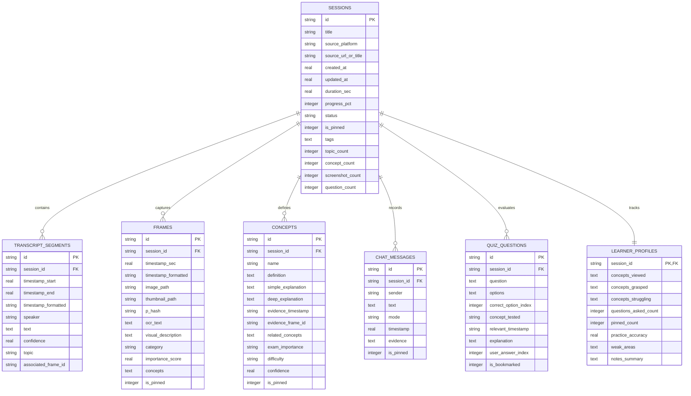

# Database & Entity Relationship Diagram (ERD)
## Project: LearnLens AI

---

## 1. Relational Database Schema (`data/learnlens.db`)

```mermaid
erDiagram
    SESSIONS ||--o{ TRANSCRIPT_SEGMENTS : contains
    SESSIONS ||--o{ FRAMES : captures
    SESSIONS ||--o{ CONCEPTS : defines
    SESSIONS ||--o{ CHAT_MESSAGES : records
    SESSIONS ||--o{ QUIZ_QUESTIONS : evaluates
    SESSIONS ||--|| LEARNER_PROFILES : tracks

    SESSIONS {
        string id PK
        string title
        string source_platform
        string source_url_or_title
        real created_at
        real updated_at
        real duration_sec
        integer progress_pct
        string status
        integer is_pinned
        text tags
        integer topic_count
        integer concept_count
        integer screenshot_count
        integer question_count
    }

    TRANSCRIPT_SEGMENTS {
        string id PK
        string session_id FK
        real timestamp_start
        real timestamp_end
        string timestamp_formatted
        string speaker
        text text
        real confidence
        string topic
        string associated_frame_id
    }

    FRAMES {
        string id PK
        string session_id FK
        real timestamp_sec
        string timestamp_formatted
        string image_path
        string thumbnail_path
        string p_hash
        text ocr_text
        text visual_description
        string category
        real importance_score
        text concepts
        integer is_pinned
    }

    CONCEPTS {
        string id PK
        string session_id FK
        string name
        text definition
        text simple_explanation
        text deep_explanation
        string evidence_timestamp
        string evidence_frame_id
        text related_concepts
        string exam_importance
        string difficulty
        real confidence
        integer is_pinned
    }

    CHAT_MESSAGES {
        string id PK
        string session_id FK
        string sender
        text text
        string mode
        real timestamp
        text evidence
        integer is_pinned
    }

    QUIZ_QUESTIONS {
        string id PK
        string session_id FK
        text question
        text options
        integer correct_option_index
        string concept_tested
        string relevant_timestamp
        text explanation
        integer user_answer_index
        integer is_bookmarked
    }

    LEARNER_PROFILES {
        string session_id PK, FK
        text concepts_viewed
        text concepts_grasped
        text concepts_struggling
        integer questions_asked_count
        integer pinned_count
        real practice_accuracy
        text weak_areas
        text notes_summary
    }
```
