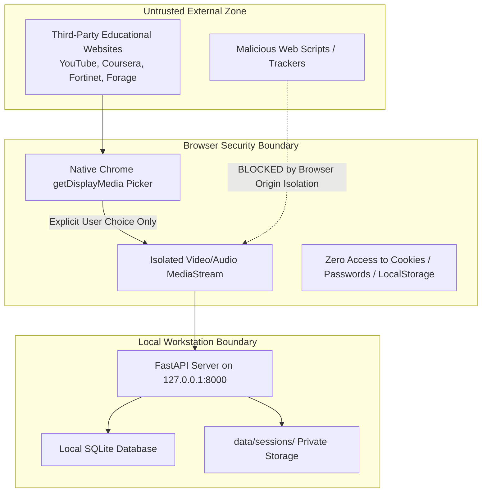

# Security & Privacy Design Document
## Project: LearnLens AI

---

## 1. Core Security & Privacy Philosophy
LearnLens AI is built upon the fundamental principle of **Local-First Data Sovereignty**. The user's screen, lecture materials, learning history, and doubts are treated as sensitive, confidential intellectual assets.

LearnLens AI does **not** rely on cloud-hosted telemetry, does not record keystrokes outside the explicit app input, and strictly isolates data processing to the host machine.

---

## 2. Threat Modeling & Attack Surface Analysis

---

## 3. Privacy Guarantees

### 3.1 Explicit Human Authorization
- Capture is initiated **only** when the user clicks "Start Learning".
- Chrome's native security dialog intercepts the call and presents the exact picker: "Chrome Tab", "Window", or "Entire Screen".
- The system **never** silently captures desktop pixels or background windows.
- When the user closes the shared tab or clicks the browser's native "Stop sharing" bar, video tracks terminate instantaneously at the hardware/OS level.

### 3.2 Zero Credential Access
- LearnLens AI operates entirely outside the website's DOM sandbox.
- It cannot read authentication cookies, session JWTs, saved passwords, or form autofill data.
- It operates strictly on the rendered graphical display buffer and audio stream explicitly emitted by the user's browser.

### 3.3 Educational Assessment Integrity
- The system explicitly refuses to impersonate users during graded evaluations.
- It provides formative coaching, gap explanations, and mock quizzes, but mandates that final test submission is an independent human action.

### 3.4 Data Retention & Right to Erasure
- All data for a session is contained in:
  1. `data/learnlens.db` (tagged by `session_id`).
  2. `data/sessions/<session_id>/` (images, vector index, and exports).
- Deleting a session executes a complete, cascading purge from both the database and the filesystem.
