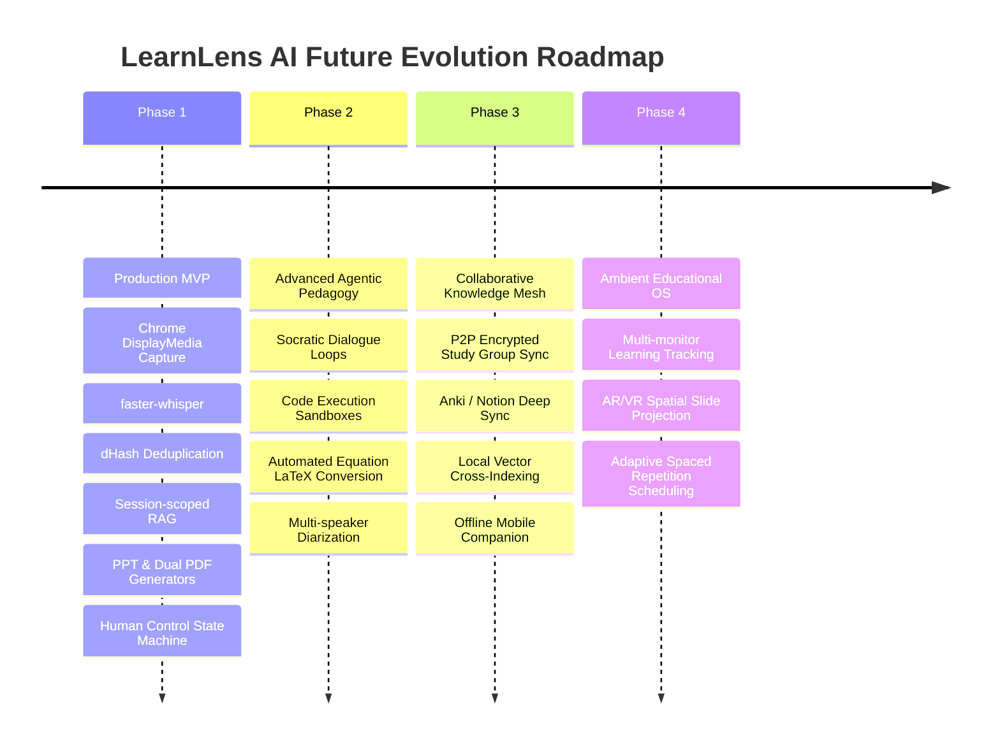

# Future Scope & Architectural Roadmap
## Project: LearnLens AI

---

## 1. Vision & Long-Term Evolution
LearnLens AI is designed to evolve from an intelligent lecture companion into a comprehensive **Personal Learning Operating System (PLOS)**. The foundational architecture—universal screen observation, multimodal fusion, session-scoped memory, and grounded pedagogical agents—provides a robust platform for future expansion.

---

## 2. Roadmap Phases

---

## 3. Key Future Capabilities

### 3.1 Live Code Sandbox Integration
Allow the AI Teacher to extract live code snippets from captured programming lectures (Python, Rust, TypeScript) and spin up a secure, ephemeral WebAssembly container (Pyodide / WebContainers) allowing the student to execute and modify code directly inside the tutoring interface.

### 3.2 Spaced Repetition & External Knowledge Sync
Export extracted concepts and flashcards directly into Anki (`.apkg`) and Notion databases via official local APIs, scheduling automated active-recall notifications based on Ebbinghaus forgetting curve intervals.

### 3.3 Peer-to-Peer Encrypted Study Groups
Enable students in the same university cohort to securely synchronize session knowledge bases using decentralized local mesh protocols (e.g. Libp2p / WebRTC) with zero central server storage, preserving student privacy while crowdsourcing lecture slide clarification.
